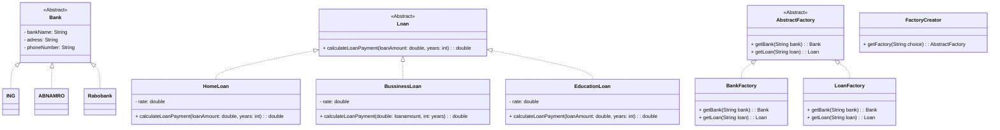

```mermaid
classDiagram
    Bank <|.. ING
    Bank <|.. ABNAMRO
    Bank <|.. Rabobank
    Loan <|.. HomeLoan
    Loan <|.. BussinessLoan
    Loan <|.. EducationLoan
    AbstractFactory <|.. BankFactory
    AbstractFactory <|.. LoanFactory
    class Bank{
        <<Abstract>>
        - bankName: String
        - adress: String
        - phoneNumber: String
    }
    class ING{
    }
    class ABNAMRO{
    }
    class Rabobank{
    }

    class Loan{
        <<Abstract>>
        + calculateLoanPayment(loanAmount: double, years: int): double
    }
    class HomeLoan{
        - rate: double
        + calculateLoanPayment(loanAmount: double, years: int): double
    }
    class BussinessLoan{
        - rate: double
        + calculateLoanPayment(double: loanamount, int: years): double
    }
    class EducationLoan{
        - rate: double
        + calculateLoanPayment(loanAmount: double, years: int): double
    }
    class AbstractFactory{
        <<Abstract>>
        + getBank(String bank): Bank
        + getLoan(String loan): Loan
    }
    class BankFactory{
        + getBank(String bank): Bank
        + getLoan(String loan): Loan
    }
    class LoanFactory{
        + getBank(String bank): Bank
        + getLoan(String loan): Loan
    }
    class FactoryCreator{
        + getFactory(String choice): AbstractFactory
    }
```